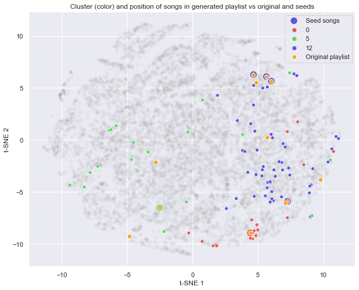
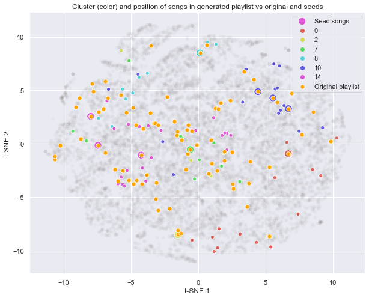
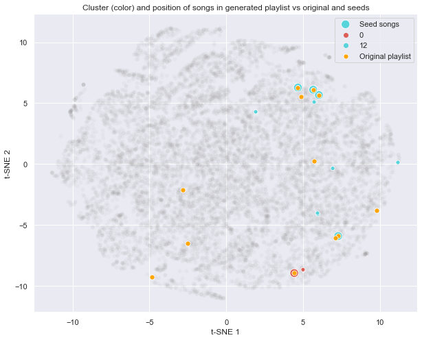

## Generating a Spotify Playlist

<a href="https://johannes-kk.github.io/TheDigitalFrontier/">Home Page</a> - 
<a href="https://johannes-kk.github.io/TheDigitalFrontier/data_preparation">Data Preparation</a> - 
<a href="https://johannes-kk.github.io/TheDigitalFrontier/data_exploration">Data Exploration</a> - 
<a href="https://johannes-kk.github.io/TheDigitalFrontier/dimensionality_reduction">Dimensionality Reduction</a> - 
<a href="https://johannes-kk.github.io/TheDigitalFrontier/clustering_techniques">Clustering Techniques</a> - 
<a href="https://johannes-kk.github.io/TheDigitalFrontier/playlist_generation"><b>Playlist Generation</b></a> - 
<a href="https://johannes-kk.github.io/TheDigitalFrontier/conclusion">Conclusion</a> - 
<a href="https://johannes-kk.github.io/TheDigitalFrontier/authors_gift">Authors' Gift</a>

-------------------------------------------------------------------------------------------------------------------

# Generating a Cold-Start Playlist

After dimension reductionality and testing multiple different clustering mechanisms, we move to the challenge of generating and assessing our own playlist from a small selection of seed songs.

We focused on using continuous features of each song (tempo, danceability, etc.) passed through dimensionality reduction and grouped using K-Means relative clustering. After arriving at a set of workable clusters for song selection, we then seed our generated playlist with a handful of manually selected songs. Our algorithm will take each seed song, identify the cluster that it belongs to and select a song from that cluster using a representative derived distance metric. It will repeat this until the desired song count has been reached.

#### Overview of playlist generation model:

- Using an autoencoder, we reduce dimensionality of song characteristics (tempo, valence, etc.).

- Using K-Means, we find clusters of songs based on the salient patterns identified by the autoencoder.

- Given a set seed songs, we identify the clusters to build playlist from.

- We find pairwise cosine distances between seed songs and every other song in the cluster.

- Finally, we generate the playlist with songs that are most similar (least cosine distance) to the seed songs.

#### Key notes:

- We did not use any artist or album information in the final model. Our model generated clusters solely based on song characteristics we pulled from the Spotify API.

- We defined similarity of songs as the co-occurance of songs in the original playlists in our dataset. We assume that these original playlists have songs that belong together as identified by Spotify users. 

- We are able to generate pairwise coside distances across the whole cluster without high computational cost because we were able to create the sparse matrix. Each row in the sparse matrix represents a song, each column represents a playlist, and each value is a binary whether the given song (row) occurs in the given playlist (column).

- The values that we clustered on are outputs from the autoencoder. The magnitude of these are difficult to interpret and as such as do not have much meaning. As such, we chose to use cosine distances rather than Euclidean distances.

### Our first generated playlist

In order to test our playlist, we wanted to see, when provided with a few seed songs from a specific existing playlist, whether our generation algorithm would produce a playlist close to the seed playlist. From our generation algorithm, we then produced the below playlist (10 random songs shown out of 100).

<table border="1" class="dataframe">
  <thead>
    <tr style="text-align: right;">
      <th></th>
      <th>artist_name</th>
      <th>artist_uri</th>
      <th>track_name</th>
      <th>album_uri</th>
      <th>duration_ms</th>
      <th>album_name</th>
      <th>count</th>
      <th>track_uri</th>
      <th>danceability</th>
      <th>energy</th>
      <th>...</th>
      <th>instrumentalness</th>
      <th>liveness</th>
      <th>valence</th>
      <th>tempo</th>
      <th>time_signature</th>
      <th>artist_genres</th>
      <th>artist_popularity</th>
      <th>album_genres</th>
      <th>album_popularity</th>
      <th>album_release_date</th>
    </tr>
    <tr>
      <th>song_id</th>
      <th></th>
      <th></th>
      <th></th>
      <th></th>
      <th></th>
      <th></th>
      <th></th>
      <th></th>
      <th></th>
      <th></th>
      <th></th>
      <th></th>
      <th></th>
      <th></th>
      <th></th>
      <th></th>
      <th></th>
      <th></th>
      <th></th>
      <th></th>
      <th></th>
    </tr>
  </thead>
  <tbody>
    <tr>
      <th>125250</th>
      <td>Rachael Yamagata</td>
      <td>spotify:artist:7w0qj2HiAPIeUcoPogvOZ6</td>
      <td>Elephants</td>
      <td>spotify:album:6KzK9fDNmj7GHFbcE4gVJD</td>
      <td>253701</td>
      <td>Elephants...Teeth Sinking Into Heart</td>
      <td>14</td>
      <td>spotify:track:0y4TKcc7p2H6P0GJlt01EI</td>
      <td>0.312</td>
      <td>0.207</td>
      <td>...</td>
      <td>0.008180</td>
      <td>0.0773</td>
      <td>0.2780</td>
      <td>93.778</td>
      <td>4</td>
      <td>['acoustic pop', 'folk-pop', 'lilith']</td>
      <td>52</td>
      <td>[]</td>
      <td>40</td>
      <td>2008-10-06</td>
    </tr>
    <tr>
      <th>787744</th>
      <td>Glee Cast</td>
      <td>spotify:artist:0SCbttzoZTnLFebDYmAWCm</td>
      <td>Somewhere Only We Know (Glee Cast Version)</td>
      <td>spotify:album:6WlzaRoDShdgVgaqJRjyNH</td>
      <td>184653</td>
      <td>Glee: The Music, The Complete Season Two</td>
      <td>86</td>
      <td>spotify:track:66mmvchQ4C3LnPzq4DiAI3</td>
      <td>0.493</td>
      <td>0.552</td>
      <td>...</td>
      <td>0.000000</td>
      <td>0.0969</td>
      <td>0.3060</td>
      <td>85.973</td>
      <td>4</td>
      <td>['glee club', 'hollywood', 'post-teen pop']</td>
      <td>80</td>
      <td>[]</td>
      <td>49</td>
      <td>2010</td>
    </tr>
    <tr>
      <th>340039</th>
      <td>Sleeping At Last</td>
      <td>spotify:artist:0MeLMJJcouYXCymQSHPn8g</td>
      <td>Chasing Cars</td>
      <td>spotify:album:0UIIvTTWNB3gRQWFoxoEDh</td>
      <td>242564</td>
      <td>Covers, Vol. 2</td>
      <td>401</td>
      <td>spotify:track:2d7LPtieXdIYzf7yHPooWd</td>
      <td>0.467</td>
      <td>0.157</td>
      <td>...</td>
      <td>0.000001</td>
      <td>0.0816</td>
      <td>0.2770</td>
      <td>108.130</td>
      <td>4</td>
      <td>['ambient worship', 'dreamo', 'folk-pop', 'pop']</td>
      <td>75</td>
      <td>[]</td>
      <td>67</td>
      <td>2016-11-04</td>
    </tr>
    <tr>
      <th>603984</th>
      <td>Rihanna</td>
      <td>spotify:artist:5pKCCKE2ajJHZ9KAiaK11H</td>
      <td>Close To You</td>
      <td>spotify:album:3Q149ZH46Z0f3oDR7vlDYV</td>
      <td>223226</td>
      <td>ANTI</td>
      <td>500</td>
      <td>spotify:track:4gFxywaJejXWxo0NjlWzgg</td>
      <td>0.494</td>
      <td>0.170</td>
      <td>...</td>
      <td>0.000000</td>
      <td>0.1390</td>
      <td>0.1450</td>
      <td>80.098</td>
      <td>4</td>
      <td>['barbadian pop', 'dance pop', 'pop', 'post-te...</td>
      <td>91</td>
      <td>[]</td>
      <td>58</td>
      <td>2016-01-28</td>
    </tr>
    <tr>
      <th>461894</th>
      <td>Mayday Parade</td>
      <td>spotify:artist:3WfJ1OtrWI7RViX9DMyEGy</td>
      <td>Terrible Things</td>
      <td>spotify:album:4eVvdwd6AC7nh9TvJD9XyT</td>
      <td>238076</td>
      <td>Valdosta EP</td>
      <td>339</td>
      <td>spotify:track:3ZjnFYlal0fXN6t61wdxhl</td>
      <td>0.285</td>
      <td>0.371</td>
      <td>...</td>
      <td>0.003920</td>
      <td>0.1040</td>
      <td>0.3720</td>
      <td>154.989</td>
      <td>3</td>
      <td>['emo', 'neon pop punk', 'pop emo', 'pop punk']</td>
      <td>68</td>
      <td>[]</td>
      <td>53</td>
      <td>2009-10-06</td>
    </tr>
    <tr>
      <th>653897</th>
      <td>The Cinematic Orchestra</td>
      <td>spotify:artist:32ogthv0BdaSMPml02X9YB</td>
      <td>To Build A Home</td>
      <td>spotify:album:5cPHT4yMCfETLRYAoBFcOZ</td>
      <td>371320</td>
      <td>Ma Fleur</td>
      <td>1593</td>
      <td>spotify:track:54KFQB6N4pn926IUUYZGzK</td>
      <td>0.264</td>
      <td>0.122</td>
      <td>...</td>
      <td>0.349000</td>
      <td>0.0940</td>
      <td>0.0735</td>
      <td>148.658</td>
      <td>4</td>
      <td>['acid jazz', 'chamber pop', 'downtempo', 'ele...</td>
      <td>65</td>
      <td>[]</td>
      <td>63</td>
      <td>2007-05-07</td>
    </tr>
    <tr>
      <th>834653</th>
      <td>Rihanna</td>
      <td>spotify:artist:5pKCCKE2ajJHZ9KAiaK11H</td>
      <td>Never Ending</td>
      <td>spotify:album:3Q149ZH46Z0f3oDR7vlDYV</td>
      <td>202506</td>
      <td>ANTI</td>
      <td>277</td>
      <td>spotify:track:6TTtJwtPEAI7yPHKR3XEKE</td>
      <td>0.530</td>
      <td>0.391</td>
      <td>...</td>
      <td>0.000070</td>
      <td>0.1870</td>
      <td>0.5210</td>
      <td>82.215</td>
      <td>4</td>
      <td>['barbadian pop', 'dance pop', 'pop', 'post-te...</td>
      <td>91</td>
      <td>[]</td>
      <td>58</td>
      <td>2016-01-28</td>
    </tr>
    <tr>
      <th>180192</th>
      <td>Mayday Parade</td>
      <td>spotify:artist:3WfJ1OtrWI7RViX9DMyEGy</td>
      <td>Miserable At Best</td>
      <td>spotify:album:0UtenXp3qVbWedKEaNRAp9</td>
      <td>316986</td>
      <td>A Lesson In Romantics</td>
      <td>619</td>
      <td>spotify:track:1ONoPkp5XIuw3tZ1GzrNKZ</td>
      <td>0.464</td>
      <td>0.362</td>
      <td>...</td>
      <td>0.000000</td>
      <td>0.1110</td>
      <td>0.4160</td>
      <td>135.255</td>
      <td>4</td>
      <td>['emo', 'neon pop punk', 'pop emo', 'pop punk']</td>
      <td>68</td>
      <td>[]</td>
      <td>63</td>
      <td>2007-07-10</td>
    </tr>
    <tr>
      <th>994457</th>
      <td>Mayday Parade</td>
      <td>spotify:artist:3WfJ1OtrWI7RViX9DMyEGy</td>
      <td>Your Song</td>
      <td>spotify:album:4eVvdwd6AC7nh9TvJD9XyT</td>
      <td>249338</td>
      <td>Valdosta EP</td>
      <td>41</td>
      <td>spotify:track:7va0FN5Fim1dNPi06sqxVx</td>
      <td>0.422</td>
      <td>0.459</td>
      <td>...</td>
      <td>0.003380</td>
      <td>0.0820</td>
      <td>0.2270</td>
      <td>144.895</td>
      <td>4</td>
      <td>['emo', 'neon pop punk', 'pop emo', 'pop punk']</td>
      <td>68</td>
      <td>[]</td>
      <td>53</td>
      <td>2009-10-06</td>
    </tr>
    <tr>
      <th>468524</th>
      <td>Rihanna</td>
      <td>spotify:artist:5pKCCKE2ajJHZ9KAiaK11H</td>
      <td>James Joint</td>
      <td>spotify:album:3Q149ZH46Z0f3oDR7vlDYV</td>
      <td>72080</td>
      <td>ANTI</td>
      <td>207</td>
      <td>spotify:track:3cuGpP8vUSC1aq8tjD3J2c</td>
      <td>0.399</td>
      <td>0.203</td>
      <td>...</td>
      <td>0.000163</td>
      <td>0.2700</td>
      <td>0.4050</td>
      <td>134.202</td>
      <td>4</td>
      <td>['barbadian pop', 'dance pop', 'pop', 'post-te...</td>
      <td>91</td>
      <td>[]</td>
      <td>58</td>
      <td>2016-01-28</td>
    </tr>
  </tbody>
</table>

10 rows × 25 columns

Manually reviewing 10 songs from our generated playlist shows artist overlap for Rihanna and Mayday Parade, indicating that our clustering algorithm is actually identifying the same artist extremely well from just 5 musical features! To further assess the clustering of the whole playlist, we charted our generated playlist in t-SNE space.

Our t-SNE graph shows the seed songs that were selected from the manually-curated playlist as the largest bubbles. All songs in the original manual playlist are highlighted in gold. Our generated songs that were not in the original playlist are colored according to the cluster that our algorithm assigns them to. For our generated playlist, we see that a fifth of songs overlap with the original seed playlist but beyond that we have fairly solid generated results within three clusters, all of which are approximately similar in t-SNE space location as well.

Combined with our manual review of the generated songs, we can develop some confidence that our algorithm is producing the start of a thematically similar generated playlist!

Our algorithm clustered together Rihanna even though we did not provide any artist / album information. Furthermore, other Rihanna songs were identified as "similar" songs and added to the generated playlist.

We tried this on several randomly selected playlists and saw some encouraging results, including several examples where generated songs had a majority overlap with the original seed playlist. We've included one such example below. Though this example has a greater number of non-overlap clusters than our first, it also shows that the majority of songs overlapped between the generated and seed playlists. 

One area of further study we would like to pursue would be researching the balance between overlap percentage and cluster proliferation to understand if our generation algorithm sees an exclusive or dependent relationship between these two optimizations.

Visual analysis of our cold-start generated playlists showed encouraging results but we wanted to layer on a more quantitative measure of success as well. To do this, we continue to rely on the assumption that manually-curated playlists can be considered "high quality" due to the understanding that someone spent the time and effort to put songs that they wanted to listen to together.

Given that assumption, we can use a derived distance calculation between a generated playlist and the library of manually-curated playlists to assess absolute or relative quality. We posit that if an algorithmically generated playlist has a low distance to a manually curated playlist, regardless of starting seed songs, then it can be considered a well-generated playlist. This distance metric is especially true when calculating the absolute quality between a generated playlist and a playlist it is specifically seeded from, such as in our earlier examples.

One critical design choice we made is that of setting a minimum threshold of song count for playlist inclusion. Because a manual playlist with few songs is likelier, by the fact that it has only a few datapoints, to appear a match or measure a low distance to a generated playlist, it represents an unfair comparison of success.

We present another randomly selected playlist as an example of our distance quality metric.

#### Calculate distance to human-created playlists and manually inspect the closest-matching

    array([0.71711053, 0.73299937, 0.76201676, 0.7628821 , 0.76480988])

Our closest playlists calculations provide us scores for the five nearest playlists of between 0.717 and 0.765, a coefficient estimate that we can use to compare playlists overall and between each other. To conclude, we manually review songs in each playlist to see if our distance coefficient holds up.

#### Generated playlist

<table border="1" class="dataframe">
  <thead>
    <tr style="text-align: right;">
      <th></th>
      <th>artist_name</th>
      <th>artist_uri</th>
      <th>track_name</th>
      <th>album_uri</th>
      <th>duration_ms</th>
      <th>album_name</th>
      <th>count</th>
      <th>track_uri</th>
      <th>danceability</th>
      <th>energy</th>
      <th>...</th>
      <th>instrumentalness</th>
      <th>liveness</th>
      <th>valence</th>
      <th>tempo</th>
      <th>time_signature</th>
      <th>artist_genres</th>
      <th>artist_popularity</th>
      <th>album_genres</th>
      <th>album_popularity</th>
      <th>album_release_date</th>
    </tr>
    <tr>
      <th>song_id</th>
      <th></th>
      <th></th>
      <th></th>
      <th></th>
      <th></th>
      <th></th>
      <th></th>
      <th></th>
      <th></th>
      <th></th>
      <th></th>
      <th></th>
      <th></th>
      <th></th>
      <th></th>
      <th></th>
      <th></th>
      <th></th>
      <th></th>
      <th></th>
      <th></th>
    </tr>
  </thead>
  <tbody>
    <tr>
      <th>125250</th>
      <td>Rachael Yamagata</td>
      <td>spotify:artist:7w0qj2HiAPIeUcoPogvOZ6</td>
      <td>Elephants</td>
      <td>spotify:album:6KzK9fDNmj7GHFbcE4gVJD</td>
      <td>253701</td>
      <td>Elephants...Teeth Sinking Into Heart</td>
      <td>14</td>
      <td>spotify:track:0y4TKcc7p2H6P0GJlt01EI</td>
      <td>0.312</td>
      <td>0.2070</td>
      <td>...</td>
      <td>0.008180</td>
      <td>0.0773</td>
      <td>0.278</td>
      <td>93.778</td>
      <td>4</td>
      <td>['acoustic pop', 'folk-pop', 'lilith']</td>
      <td>52</td>
      <td>[]</td>
      <td>40</td>
      <td>2008-10-06</td>
    </tr>
    <tr>
      <th>787744</th>
      <td>Glee Cast</td>
      <td>spotify:artist:0SCbttzoZTnLFebDYmAWCm</td>
      <td>Somewhere Only We Know (Glee Cast Version)</td>
      <td>spotify:album:6WlzaRoDShdgVgaqJRjyNH</td>
      <td>184653</td>
      <td>Glee: The Music, The Complete Season Two</td>
      <td>86</td>
      <td>spotify:track:66mmvchQ4C3LnPzq4DiAI3</td>
      <td>0.493</td>
      <td>0.5520</td>
      <td>...</td>
      <td>0.000000</td>
      <td>0.0969</td>
      <td>0.306</td>
      <td>85.973</td>
      <td>4</td>
      <td>['glee club', 'hollywood', 'post-teen pop']</td>
      <td>80</td>
      <td>[]</td>
      <td>49</td>
      <td>2010</td>
    </tr>
    <tr>
      <th>340039</th>
      <td>Sleeping At Last</td>
      <td>spotify:artist:0MeLMJJcouYXCymQSHPn8g</td>
      <td>Chasing Cars</td>
      <td>spotify:album:0UIIvTTWNB3gRQWFoxoEDh</td>
      <td>242564</td>
      <td>Covers, Vol. 2</td>
      <td>401</td>
      <td>spotify:track:2d7LPtieXdIYzf7yHPooWd</td>
      <td>0.467</td>
      <td>0.1570</td>
      <td>...</td>
      <td>0.000001</td>
      <td>0.0816</td>
      <td>0.277</td>
      <td>108.130</td>
      <td>4</td>
      <td>['ambient worship', 'dreamo', 'folk-pop', 'pop']</td>
      <td>75</td>
      <td>[]</td>
      <td>67</td>
      <td>2016-11-04</td>
    </tr>
    <tr>
      <th>603984</th>
      <td>Rihanna</td>
      <td>spotify:artist:5pKCCKE2ajJHZ9KAiaK11H</td>
      <td>Close To You</td>
      <td>spotify:album:3Q149ZH46Z0f3oDR7vlDYV</td>
      <td>223226</td>
      <td>ANTI</td>
      <td>500</td>
      <td>spotify:track:4gFxywaJejXWxo0NjlWzgg</td>
      <td>0.494</td>
      <td>0.1700</td>
      <td>...</td>
      <td>0.000000</td>
      <td>0.1390</td>
      <td>0.145</td>
      <td>80.098</td>
      <td>4</td>
      <td>['barbadian pop', 'dance pop', 'pop', 'post-te...</td>
      <td>91</td>
      <td>[]</td>
      <td>58</td>
      <td>2016-01-28</td>
    </tr>
    <tr>
      <th>461894</th>
      <td>Mayday Parade</td>
      <td>spotify:artist:3WfJ1OtrWI7RViX9DMyEGy</td>
      <td>Terrible Things</td>
      <td>spotify:album:4eVvdwd6AC7nh9TvJD9XyT</td>
      <td>238076</td>
      <td>Valdosta EP</td>
      <td>339</td>
      <td>spotify:track:3ZjnFYlal0fXN6t61wdxhl</td>
      <td>0.285</td>
      <td>0.3710</td>
      <td>...</td>
      <td>0.003920</td>
      <td>0.1040</td>
      <td>0.372</td>
      <td>154.989</td>
      <td>3</td>
      <td>['emo', 'neon pop punk', 'pop emo', 'pop punk']</td>
      <td>68</td>
      <td>[]</td>
      <td>53</td>
      <td>2009-10-06</td>
    </tr>
    <tr>
      <th>834653</th>
      <td>Rihanna</td>
      <td>spotify:artist:5pKCCKE2ajJHZ9KAiaK11H</td>
      <td>Never Ending</td>
      <td>spotify:album:3Q149ZH46Z0f3oDR7vlDYV</td>
      <td>202506</td>
      <td>ANTI</td>
      <td>277</td>
      <td>spotify:track:6TTtJwtPEAI7yPHKR3XEKE</td>
      <td>0.530</td>
      <td>0.3910</td>
      <td>...</td>
      <td>0.000070</td>
      <td>0.1870</td>
      <td>0.521</td>
      <td>82.215</td>
      <td>4</td>
      <td>['barbadian pop', 'dance pop', 'pop', 'post-te...</td>
      <td>91</td>
      <td>[]</td>
      <td>58</td>
      <td>2016-01-28</td>
    </tr>
    <tr>
      <th>772125</th>
      <td>Sleeping At Last</td>
      <td>spotify:artist:0MeLMJJcouYXCymQSHPn8g</td>
      <td>Already Gone</td>
      <td>spotify:album:0UIIvTTWNB3gRQWFoxoEDh</td>
      <td>243007</td>
      <td>Covers, Vol. 2</td>
      <td>253</td>
      <td>spotify:track:5zCunX8URvLoBHlg1Fnjv6</td>
      <td>0.418</td>
      <td>0.2480</td>
      <td>...</td>
      <td>0.000004</td>
      <td>0.1080</td>
      <td>0.298</td>
      <td>130.953</td>
      <td>4</td>
      <td>['ambient worship', 'dreamo', 'folk-pop', 'pop']</td>
      <td>75</td>
      <td>[]</td>
      <td>67</td>
      <td>2016-11-04</td>
    </tr>
    <tr>
      <th>521562</th>
      <td>Stars</td>
      <td>spotify:artist:2EO56JK4txid1Pss9GVbOL</td>
      <td>Personal</td>
      <td>spotify:album:4I9BDOOxpLw2ClFDRhTJaN</td>
      <td>247173</td>
      <td>In Our Bedroom After The War</td>
      <td>17</td>
      <td>spotify:track:42MSqGOJ5o2VQgC01Zlcd5</td>
      <td>0.580</td>
      <td>0.1800</td>
      <td>...</td>
      <td>0.037000</td>
      <td>0.2310</td>
      <td>0.137</td>
      <td>129.805</td>
      <td>4</td>
      <td>['canadian indie', 'canadian pop', 'chamber po...</td>
      <td>50</td>
      <td>[]</td>
      <td>38</td>
      <td>2007-09-25</td>
    </tr>
    <tr>
      <th>195814</th>
      <td>Glee Cast</td>
      <td>spotify:artist:0SCbttzoZTnLFebDYmAWCm</td>
      <td>Fix You (Glee Cast Version)</td>
      <td>spotify:album:082BH67sSIDefLxUp8GgNm</td>
      <td>274760</td>
      <td>Glee: The Music, The Complete Season Three</td>
      <td>23</td>
      <td>spotify:track:1VzkNDKMsnkVf3nV6Ki5GW</td>
      <td>0.438</td>
      <td>0.4070</td>
      <td>...</td>
      <td>0.000011</td>
      <td>0.1160</td>
      <td>0.275</td>
      <td>133.970</td>
      <td>4</td>
      <td>['glee club', 'hollywood', 'post-teen pop']</td>
      <td>80</td>
      <td>[]</td>
      <td>47</td>
      <td>2011</td>
    </tr>
    <tr>
      <th>468524</th>
      <td>Rihanna</td>
      <td>spotify:artist:5pKCCKE2ajJHZ9KAiaK11H</td>
      <td>James Joint</td>
      <td>spotify:album:3Q149ZH46Z0f3oDR7vlDYV</td>
      <td>72080</td>
      <td>ANTI</td>
      <td>207</td>
      <td>spotify:track:3cuGpP8vUSC1aq8tjD3J2c</td>
      <td>0.399</td>
      <td>0.2030</td>
      <td>...</td>
      <td>0.000163</td>
      <td>0.2700</td>
      <td>0.405</td>
      <td>134.202</td>
      <td>4</td>
      <td>['barbadian pop', 'dance pop', 'pop', 'post-te...</td>
      <td>91</td>
      <td>[]</td>
      <td>58</td>
      <td>2016-01-28</td>
    </tr>
    <tr>
      <th>541794</th>
      <td>A Fine Frenzy</td>
      <td>spotify:artist:5dTYaRzOn4rXGBLH052EeQ</td>
      <td>Riversong</td>
      <td>spotify:album:0jW4xokRXUFjI2lQEiYW5j</td>
      <td>466367</td>
      <td>PINES</td>
      <td>5</td>
      <td>spotify:track:4C7BYd7U3FXXXy1hlvN9jg</td>
      <td>0.303</td>
      <td>0.0714</td>
      <td>...</td>
      <td>0.000036</td>
      <td>0.0995</td>
      <td>0.116</td>
      <td>104.512</td>
      <td>4</td>
      <td>['acoustic pop', 'folk-pop', 'lilith', 'neo me...</td>
      <td>52</td>
      <td>[]</td>
      <td>14</td>
      <td>2012-01-01</td>
    </tr>
    <tr>
      <th>460009</th>
      <td>Camille</td>
      <td>spotify:artist:0gOsZcHl7H3ewXVIEnWFZX</td>
      <td>Pour que l'amour me quitte</td>
      <td>spotify:album:1AY69raETX2k8Y2zCfIhuI</td>
      <td>166720</td>
      <td>Le fil</td>
      <td>5</td>
      <td>spotify:track:3YqUUxjoYCErSxCWxBMslJ</td>
      <td>0.408</td>
      <td>0.2010</td>
      <td>...</td>
      <td>0.124000</td>
      <td>0.1090</td>
      <td>0.191</td>
      <td>145.616</td>
      <td>4</td>
      <td>['chanson', 'french indie pop', 'french rock']</td>
      <td>56</td>
      <td>[]</td>
      <td>2</td>
      <td>2005-02-14</td>
    </tr>
  </tbody>
</table>

12 rows × 25 columns

#### Closest matching

<table border="1" class="dataframe">
  <thead>
    <tr style="text-align: right;">
      <th></th>
      <th>artist_name</th>
      <th>artist_uri</th>
      <th>track_name</th>
      <th>album_uri</th>
      <th>duration_ms</th>
      <th>album_name</th>
      <th>count</th>
      <th>track_uri</th>
      <th>danceability</th>
      <th>energy</th>
      <th>...</th>
      <th>instrumentalness</th>
      <th>liveness</th>
      <th>valence</th>
      <th>tempo</th>
      <th>time_signature</th>
      <th>artist_genres</th>
      <th>artist_popularity</th>
      <th>album_genres</th>
      <th>album_popularity</th>
      <th>album_release_date</th>
    </tr>
    <tr>
      <th>song_id</th>
      <th></th>
      <th></th>
      <th></th>
      <th></th>
      <th></th>
      <th></th>
      <th></th>
      <th></th>
      <th></th>
      <th></th>
      <th></th>
      <th></th>
      <th></th>
      <th></th>
      <th></th>
      <th></th>
      <th></th>
      <th></th>
      <th></th>
      <th></th>
      <th></th>
    </tr>
  </thead>
  <tbody>
    <tr>
      <th>125250</th>
      <td>Rachael Yamagata</td>
      <td>spotify:artist:7w0qj2HiAPIeUcoPogvOZ6</td>
      <td>Elephants</td>
      <td>spotify:album:6KzK9fDNmj7GHFbcE4gVJD</td>
      <td>253701</td>
      <td>Elephants...Teeth Sinking Into Heart</td>
      <td>14</td>
      <td>spotify:track:0y4TKcc7p2H6P0GJlt01EI</td>
      <td>0.312</td>
      <td>0.2070</td>
      <td>...</td>
      <td>0.008180</td>
      <td>0.0773</td>
      <td>0.2780</td>
      <td>93.778</td>
      <td>4</td>
      <td>['acoustic pop', 'folk-pop', 'lilith']</td>
      <td>52</td>
      <td>[]</td>
      <td>40</td>
      <td>2008-10-06</td>
    </tr>
    <tr>
      <th>787744</th>
      <td>Glee Cast</td>
      <td>spotify:artist:0SCbttzoZTnLFebDYmAWCm</td>
      <td>Somewhere Only We Know (Glee Cast Version)</td>
      <td>spotify:album:6WlzaRoDShdgVgaqJRjyNH</td>
      <td>184653</td>
      <td>Glee: The Music, The Complete Season Two</td>
      <td>86</td>
      <td>spotify:track:66mmvchQ4C3LnPzq4DiAI3</td>
      <td>0.493</td>
      <td>0.5520</td>
      <td>...</td>
      <td>0.000000</td>
      <td>0.0969</td>
      <td>0.3060</td>
      <td>85.973</td>
      <td>4</td>
      <td>['glee club', 'hollywood', 'post-teen pop']</td>
      <td>80</td>
      <td>[]</td>
      <td>49</td>
      <td>2010</td>
    </tr>
    <tr>
      <th>340039</th>
      <td>Sleeping At Last</td>
      <td>spotify:artist:0MeLMJJcouYXCymQSHPn8g</td>
      <td>Chasing Cars</td>
      <td>spotify:album:0UIIvTTWNB3gRQWFoxoEDh</td>
      <td>242564</td>
      <td>Covers, Vol. 2</td>
      <td>401</td>
      <td>spotify:track:2d7LPtieXdIYzf7yHPooWd</td>
      <td>0.467</td>
      <td>0.1570</td>
      <td>...</td>
      <td>0.000001</td>
      <td>0.0816</td>
      <td>0.2770</td>
      <td>108.130</td>
      <td>4</td>
      <td>['ambient worship', 'dreamo', 'folk-pop', 'pop']</td>
      <td>75</td>
      <td>[]</td>
      <td>67</td>
      <td>2016-11-04</td>
    </tr>
    <tr>
      <th>603984</th>
      <td>Rihanna</td>
      <td>spotify:artist:5pKCCKE2ajJHZ9KAiaK11H</td>
      <td>Close To You</td>
      <td>spotify:album:3Q149ZH46Z0f3oDR7vlDYV</td>
      <td>223226</td>
      <td>ANTI</td>
      <td>500</td>
      <td>spotify:track:4gFxywaJejXWxo0NjlWzgg</td>
      <td>0.494</td>
      <td>0.1700</td>
      <td>...</td>
      <td>0.000000</td>
      <td>0.1390</td>
      <td>0.1450</td>
      <td>80.098</td>
      <td>4</td>
      <td>['barbadian pop', 'dance pop', 'pop', 'post-te...</td>
      <td>91</td>
      <td>[]</td>
      <td>58</td>
      <td>2016-01-28</td>
    </tr>
    <tr>
      <th>461894</th>
      <td>Mayday Parade</td>
      <td>spotify:artist:3WfJ1OtrWI7RViX9DMyEGy</td>
      <td>Terrible Things</td>
      <td>spotify:album:4eVvdwd6AC7nh9TvJD9XyT</td>
      <td>238076</td>
      <td>Valdosta EP</td>
      <td>339</td>
      <td>spotify:track:3ZjnFYlal0fXN6t61wdxhl</td>
      <td>0.285</td>
      <td>0.3710</td>
      <td>...</td>
      <td>0.003920</td>
      <td>0.1040</td>
      <td>0.3720</td>
      <td>154.989</td>
      <td>3</td>
      <td>['emo', 'neon pop punk', 'pop emo', 'pop punk']</td>
      <td>68</td>
      <td>[]</td>
      <td>53</td>
      <td>2009-10-06</td>
    </tr>
    <tr>
      <th>653897</th>
      <td>The Cinematic Orchestra</td>
      <td>spotify:artist:32ogthv0BdaSMPml02X9YB</td>
      <td>To Build A Home</td>
      <td>spotify:album:5cPHT4yMCfETLRYAoBFcOZ</td>
      <td>371320</td>
      <td>Ma Fleur</td>
      <td>1593</td>
      <td>spotify:track:54KFQB6N4pn926IUUYZGzK</td>
      <td>0.264</td>
      <td>0.1220</td>
      <td>...</td>
      <td>0.349000</td>
      <td>0.0940</td>
      <td>0.0735</td>
      <td>148.658</td>
      <td>4</td>
      <td>['acid jazz', 'chamber pop', 'downtempo', 'ele...</td>
      <td>65</td>
      <td>[]</td>
      <td>63</td>
      <td>2007-05-07</td>
    </tr>
    <tr>
      <th>881533</th>
      <td>The Cinematic Orchestra</td>
      <td>spotify:artist:32ogthv0BdaSMPml02X9YB</td>
      <td>That Home</td>
      <td>spotify:album:5cPHT4yMCfETLRYAoBFcOZ</td>
      <td>103920</td>
      <td>Ma Fleur</td>
      <td>121</td>
      <td>spotify:track:6q4c1vPRZREh7nw3wG7Ixz</td>
      <td>0.412</td>
      <td>0.1590</td>
      <td>...</td>
      <td>0.772000</td>
      <td>0.0830</td>
      <td>0.0389</td>
      <td>85.462</td>
      <td>4</td>
      <td>['acid jazz', 'chamber pop', 'downtempo', 'ele...</td>
      <td>65</td>
      <td>[]</td>
      <td>63</td>
      <td>2007-05-07</td>
    </tr>
    <tr>
      <th>894661</th>
      <td>Shawn Mendes</td>
      <td>spotify:artist:7n2wHs1TKAczGzO7Dd2rGr</td>
      <td>Never Be Alone</td>
      <td>spotify:album:5wKylB0Zwnxz046O7po25D</td>
      <td>215813</td>
      <td>Handwritten</td>
      <td>626</td>
      <td>spotify:track:6wQSrFnJYm3evLsavFeCVT</td>
      <td>0.376</td>
      <td>0.4660</td>
      <td>...</td>
      <td>0.000058</td>
      <td>0.0781</td>
      <td>0.2760</td>
      <td>199.835</td>
      <td>4</td>
      <td>['canadian pop', 'pop', 'post-teen pop', 'vira...</td>
      <td>93</td>
      <td>[]</td>
      <td>18</td>
      <td>2015-04-13</td>
    </tr>
    <tr>
      <th>810569</th>
      <td>Josef Salvat</td>
      <td>spotify:artist:64PJHZDQTPPVBCdwnv22Wz</td>
      <td>Diamonds</td>
      <td>spotify:album:1excMWyBjh9UJqk2xYZ7o0</td>
      <td>247600</td>
      <td>Night Swim</td>
      <td>44</td>
      <td>spotify:track:6Hki3HcbeU2c4T72lJjyZ5</td>
      <td>0.462</td>
      <td>0.3720</td>
      <td>...</td>
      <td>0.000452</td>
      <td>0.1020</td>
      <td>0.2760</td>
      <td>169.931</td>
      <td>4</td>
      <td>['gauze pop']</td>
      <td>53</td>
      <td>[]</td>
      <td>35</td>
      <td>2015-10-23</td>
    </tr>
    <tr>
      <th>49614</th>
      <td>Leon Bridges</td>
      <td>spotify:artist:3qnGvpP8Yth1AqSBMqON5x</td>
      <td>River</td>
      <td>spotify:album:4svLfrPPk2npPVuI4kXPYg</td>
      <td>238560</td>
      <td>Coming Home</td>
      <td>989</td>
      <td>spotify:track:0NeJjNlprGfZpeX2LQuN6c</td>
      <td>0.658</td>
      <td>0.1790</td>
      <td>...</td>
      <td>0.000000</td>
      <td>0.1700</td>
      <td>0.1910</td>
      <td>128.128</td>
      <td>4</td>
      <td>['modern blues', 'soul']</td>
      <td>75</td>
      <td>[]</td>
      <td>70</td>
      <td>2015-06-15</td>
    </tr>
    <tr>
      <th>776037</th>
      <td>nilu</td>
      <td>spotify:artist:1XplrA4Q9dPFcayYbJqX6K</td>
      <td>How to Save a Life</td>
      <td>spotify:album:3JymwO9er7CrAoJULoogfq</td>
      <td>262500</td>
      <td>How to Save a Life</td>
      <td>59</td>
      <td>spotify:track:617EQMgzYFe2THz093j68m</td>
      <td>0.366</td>
      <td>0.0709</td>
      <td>...</td>
      <td>0.000000</td>
      <td>0.0936</td>
      <td>0.1550</td>
      <td>94.502</td>
      <td>4</td>
      <td>[]</td>
      <td>44</td>
      <td>[]</td>
      <td>34</td>
      <td>2015-05-11</td>
    </tr>
    <tr>
      <th>356319</th>
      <td>Ryan Amador</td>
      <td>spotify:artist:1ihU4zSTmY0qQXhx8jEXWT</td>
      <td>Instead</td>
      <td>spotify:album:1t1kSv0ySypwFXKgyocRRk</td>
      <td>355529</td>
      <td>Ryan Amador</td>
      <td>117</td>
      <td>spotify:track:2kuFVY6hWX6yavTiWHE3SQ</td>
      <td>0.365</td>
      <td>0.2600</td>
      <td>...</td>
      <td>0.000000</td>
      <td>0.1010</td>
      <td>0.2340</td>
      <td>161.637</td>
      <td>3</td>
      <td>[]</td>
      <td>37</td>
      <td>[]</td>
      <td>39</td>
      <td>2013-06-28</td>
    </tr>
  </tbody>
</table>

12 rows × 25 columns

#### 2nd closest matching

<table border="1" class="dataframe">
  <thead>
    <tr style="text-align: right;">
      <th></th>
      <th>artist_name</th>
      <th>artist_uri</th>
      <th>track_name</th>
      <th>album_uri</th>
      <th>duration_ms</th>
      <th>album_name</th>
      <th>count</th>
      <th>track_uri</th>
      <th>danceability</th>
      <th>energy</th>
      <th>...</th>
      <th>instrumentalness</th>
      <th>liveness</th>
      <th>valence</th>
      <th>tempo</th>
      <th>time_signature</th>
      <th>artist_genres</th>
      <th>artist_popularity</th>
      <th>album_genres</th>
      <th>album_popularity</th>
      <th>album_release_date</th>
    </tr>
    <tr>
      <th>song_id</th>
      <th></th>
      <th></th>
      <th></th>
      <th></th>
      <th></th>
      <th></th>
      <th></th>
      <th></th>
      <th></th>
      <th></th>
      <th></th>
      <th></th>
      <th></th>
      <th></th>
      <th></th>
      <th></th>
      <th></th>
      <th></th>
      <th></th>
      <th></th>
      <th></th>
    </tr>
  </thead>
  <tbody>
    <tr>
      <th>8489</th>
      <td>Rihanna</td>
      <td>spotify:artist:5pKCCKE2ajJHZ9KAiaK11H</td>
      <td>Same Ol’ Mistakes</td>
      <td>spotify:album:3Q149ZH46Z0f3oDR7vlDYV</td>
      <td>397093</td>
      <td>ANTI</td>
      <td>433</td>
      <td>spotify:track:046irIGshCqu24AjmEWZtr</td>
      <td>0.440</td>
      <td>0.803</td>
      <td>...</td>
      <td>0.002820</td>
      <td>0.0591</td>
      <td>0.5010</td>
      <td>151.777</td>
      <td>4</td>
      <td>['barbadian pop', 'dance pop', 'pop', 'post-te...</td>
      <td>91</td>
      <td>[]</td>
      <td>58</td>
      <td>2016-01-28</td>
    </tr>
    <tr>
      <th>68416</th>
      <td>Rihanna</td>
      <td>spotify:artist:5pKCCKE2ajJHZ9KAiaK11H</td>
      <td>Consideration</td>
      <td>spotify:album:3Q149ZH46Z0f3oDR7vlDYV</td>
      <td>161066</td>
      <td>ANTI</td>
      <td>692</td>
      <td>spotify:track:0WgBb7XgdtbUW0GlYel9mH</td>
      <td>0.883</td>
      <td>0.584</td>
      <td>...</td>
      <td>0.000004</td>
      <td>0.0869</td>
      <td>0.7840</td>
      <td>144.975</td>
      <td>4</td>
      <td>['barbadian pop', 'dance pop', 'pop', 'post-te...</td>
      <td>91</td>
      <td>[]</td>
      <td>58</td>
      <td>2016-01-28</td>
    </tr>
    <tr>
      <th>191443</th>
      <td>Rihanna</td>
      <td>spotify:artist:5pKCCKE2ajJHZ9KAiaK11H</td>
      <td>Needed Me</td>
      <td>spotify:album:3Q149ZH46Z0f3oDR7vlDYV</td>
      <td>191600</td>
      <td>ANTI</td>
      <td>5369</td>
      <td>spotify:track:1Tt4sE4pXi57mTD1GCzsqm</td>
      <td>0.671</td>
      <td>0.314</td>
      <td>...</td>
      <td>0.000000</td>
      <td>0.0825</td>
      <td>0.2960</td>
      <td>110.898</td>
      <td>4</td>
      <td>['barbadian pop', 'dance pop', 'pop', 'post-te...</td>
      <td>91</td>
      <td>[]</td>
      <td>58</td>
      <td>2016-01-28</td>
    </tr>
    <tr>
      <th>199776</th>
      <td>Rihanna</td>
      <td>spotify:artist:5pKCCKE2ajJHZ9KAiaK11H</td>
      <td>Higher</td>
      <td>spotify:album:3Q149ZH46Z0f3oDR7vlDYV</td>
      <td>120626</td>
      <td>ANTI</td>
      <td>590</td>
      <td>spotify:track:1XrrzhGLErbkiwH5v3xww9</td>
      <td>0.292</td>
      <td>0.567</td>
      <td>...</td>
      <td>0.000001</td>
      <td>0.1190</td>
      <td>0.3920</td>
      <td>153.199</td>
      <td>3</td>
      <td>['barbadian pop', 'dance pop', 'pop', 'post-te...</td>
      <td>91</td>
      <td>[]</td>
      <td>58</td>
      <td>2016-01-28</td>
    </tr>
    <tr>
      <th>310316</th>
      <td>Rihanna</td>
      <td>spotify:artist:5pKCCKE2ajJHZ9KAiaK11H</td>
      <td>Woo</td>
      <td>spotify:album:3Q149ZH46Z0f3oDR7vlDYV</td>
      <td>235586</td>
      <td>ANTI</td>
      <td>260</td>
      <td>spotify:track:2OvftP4F7VMMTdfyUx883s</td>
      <td>0.420</td>
      <td>0.466</td>
      <td>...</td>
      <td>0.003890</td>
      <td>0.2980</td>
      <td>0.1850</td>
      <td>115.004</td>
      <td>4</td>
      <td>['barbadian pop', 'dance pop', 'pop', 'post-te...</td>
      <td>91</td>
      <td>[]</td>
      <td>58</td>
      <td>2016-01-28</td>
    </tr>
    <tr>
      <th>335121</th>
      <td>Rihanna</td>
      <td>spotify:artist:5pKCCKE2ajJHZ9KAiaK11H</td>
      <td>Love On The Brain</td>
      <td>spotify:album:3Q149ZH46Z0f3oDR7vlDYV</td>
      <td>224000</td>
      <td>ANTI</td>
      <td>3073</td>
      <td>spotify:track:2aksifNn5ph8igDOkPBA02</td>
      <td>0.509</td>
      <td>0.637</td>
      <td>...</td>
      <td>0.000011</td>
      <td>0.0789</td>
      <td>0.3780</td>
      <td>172.006</td>
      <td>3</td>
      <td>['barbadian pop', 'dance pop', 'pop', 'post-te...</td>
      <td>91</td>
      <td>[]</td>
      <td>58</td>
      <td>2016-01-28</td>
    </tr>
    <tr>
      <th>468524</th>
      <td>Rihanna</td>
      <td>spotify:artist:5pKCCKE2ajJHZ9KAiaK11H</td>
      <td>James Joint</td>
      <td>spotify:album:3Q149ZH46Z0f3oDR7vlDYV</td>
      <td>72080</td>
      <td>ANTI</td>
      <td>207</td>
      <td>spotify:track:3cuGpP8vUSC1aq8tjD3J2c</td>
      <td>0.399</td>
      <td>0.203</td>
      <td>...</td>
      <td>0.000163</td>
      <td>0.2700</td>
      <td>0.4050</td>
      <td>134.202</td>
      <td>4</td>
      <td>['barbadian pop', 'dance pop', 'pop', 'post-te...</td>
      <td>91</td>
      <td>[]</td>
      <td>58</td>
      <td>2016-01-28</td>
    </tr>
    <tr>
      <th>603984</th>
      <td>Rihanna</td>
      <td>spotify:artist:5pKCCKE2ajJHZ9KAiaK11H</td>
      <td>Close To You</td>
      <td>spotify:album:3Q149ZH46Z0f3oDR7vlDYV</td>
      <td>223226</td>
      <td>ANTI</td>
      <td>500</td>
      <td>spotify:track:4gFxywaJejXWxo0NjlWzgg</td>
      <td>0.494</td>
      <td>0.170</td>
      <td>...</td>
      <td>0.000000</td>
      <td>0.1390</td>
      <td>0.1450</td>
      <td>80.098</td>
      <td>4</td>
      <td>['barbadian pop', 'dance pop', 'pop', 'post-te...</td>
      <td>91</td>
      <td>[]</td>
      <td>58</td>
      <td>2016-01-28</td>
    </tr>
    <tr>
      <th>613612</th>
      <td>Rihanna</td>
      <td>spotify:artist:5pKCCKE2ajJHZ9KAiaK11H</td>
      <td>Yeah, I Said It</td>
      <td>spotify:album:3Q149ZH46Z0f3oDR7vlDYV</td>
      <td>133080</td>
      <td>ANTI</td>
      <td>559</td>
      <td>spotify:track:4kqxy0SvQ2N34nOJ9ggfMu</td>
      <td>0.509</td>
      <td>0.380</td>
      <td>...</td>
      <td>0.000001</td>
      <td>0.3600</td>
      <td>0.2490</td>
      <td>127.880</td>
      <td>4</td>
      <td>['barbadian pop', 'dance pop', 'pop', 'post-te...</td>
      <td>91</td>
      <td>[]</td>
      <td>58</td>
      <td>2016-01-28</td>
    </tr>
    <tr>
      <th>815849</th>
      <td>Rihanna</td>
      <td>spotify:artist:5pKCCKE2ajJHZ9KAiaK11H</td>
      <td>Desperado</td>
      <td>spotify:album:3Q149ZH46Z0f3oDR7vlDYV</td>
      <td>186466</td>
      <td>ANTI</td>
      <td>1144</td>
      <td>spotify:track:6KFaHC9G178beAp7P0Vi5S</td>
      <td>0.685</td>
      <td>0.610</td>
      <td>...</td>
      <td>0.000000</td>
      <td>0.1020</td>
      <td>0.3230</td>
      <td>94.384</td>
      <td>3</td>
      <td>['barbadian pop', 'dance pop', 'pop', 'post-te...</td>
      <td>91</td>
      <td>[]</td>
      <td>58</td>
      <td>2016-01-28</td>
    </tr>
    <tr>
      <th>834653</th>
      <td>Rihanna</td>
      <td>spotify:artist:5pKCCKE2ajJHZ9KAiaK11H</td>
      <td>Never Ending</td>
      <td>spotify:album:3Q149ZH46Z0f3oDR7vlDYV</td>
      <td>202506</td>
      <td>ANTI</td>
      <td>277</td>
      <td>spotify:track:6TTtJwtPEAI7yPHKR3XEKE</td>
      <td>0.530</td>
      <td>0.391</td>
      <td>...</td>
      <td>0.000070</td>
      <td>0.1870</td>
      <td>0.5210</td>
      <td>82.215</td>
      <td>4</td>
      <td>['barbadian pop', 'dance pop', 'pop', 'post-te...</td>
      <td>91</td>
      <td>[]</td>
      <td>58</td>
      <td>2016-01-28</td>
    </tr>
    <tr>
      <th>953321</th>
      <td>Rihanna</td>
      <td>spotify:artist:5pKCCKE2ajJHZ9KAiaK11H</td>
      <td>Kiss It Better</td>
      <td>spotify:album:3Q149ZH46Z0f3oDR7vlDYV</td>
      <td>253080</td>
      <td>ANTI</td>
      <td>1033</td>
      <td>spotify:track:7bmqcI1HQwx1PWwYyZO0lg</td>
      <td>0.619</td>
      <td>0.806</td>
      <td>...</td>
      <td>0.000000</td>
      <td>0.0671</td>
      <td>0.8770</td>
      <td>95.000</td>
      <td>4</td>
      <td>['barbadian pop', 'dance pop', 'pop', 'post-te...</td>
      <td>91</td>
      <td>[]</td>
      <td>58</td>
      <td>2016-01-28</td>
    </tr>
    <tr>
      <th>138902</th>
      <td>Rihanna</td>
      <td>spotify:artist:5pKCCKE2ajJHZ9KAiaK11H</td>
      <td>Work</td>
      <td>spotify:album:2JNVoEx4psIgNQyEExwQVn</td>
      <td>219320</td>
      <td>ANTI</td>
      <td>4683</td>
      <td>spotify:track:14WWzenpaEgQZlqPq2nk4v</td>
      <td>0.725</td>
      <td>0.534</td>
      <td>...</td>
      <td>0.000000</td>
      <td>0.0919</td>
      <td>0.5580</td>
      <td>91.974</td>
      <td>4</td>
      <td>['barbadian pop', 'dance pop', 'pop', 'post-te...</td>
      <td>91</td>
      <td>[]</td>
      <td>15</td>
      <td>2016-01-28</td>
    </tr>
    <tr>
      <th>343268</th>
      <td>Rihanna</td>
      <td>spotify:artist:5pKCCKE2ajJHZ9KAiaK11H</td>
      <td>Pose</td>
      <td>spotify:album:19O3rXe4nDu9YDcc2tOQVn</td>
      <td>144226</td>
      <td>ANTI</td>
      <td>109</td>
      <td>spotify:track:2eghogEKiH7hM70GYkF1XD</td>
      <td>0.684</td>
      <td>0.840</td>
      <td>...</td>
      <td>0.000223</td>
      <td>0.1550</td>
      <td>0.7440</td>
      <td>145.905</td>
      <td>4</td>
      <td>['barbadian pop', 'dance pop', 'pop', 'post-te...</td>
      <td>91</td>
      <td>[]</td>
      <td>49</td>
      <td>2016-01-28</td>
    </tr>
    <tr>
      <th>371613</th>
      <td>Rihanna</td>
      <td>spotify:artist:5pKCCKE2ajJHZ9KAiaK11H</td>
      <td>Goodnight Gotham</td>
      <td>spotify:album:19O3rXe4nDu9YDcc2tOQVn</td>
      <td>88493</td>
      <td>ANTI</td>
      <td>73</td>
      <td>spotify:track:2sHNQyTbE3ZvhjBFGqLxJU</td>
      <td>0.447</td>
      <td>0.674</td>
      <td>...</td>
      <td>0.000006</td>
      <td>0.2900</td>
      <td>0.3210</td>
      <td>81.995</td>
      <td>4</td>
      <td>['barbadian pop', 'dance pop', 'pop', 'post-te...</td>
      <td>91</td>
      <td>[]</td>
      <td>49</td>
      <td>2016-01-28</td>
    </tr>
    <tr>
      <th>840310</th>
      <td>Rihanna</td>
      <td>spotify:artist:5pKCCKE2ajJHZ9KAiaK11H</td>
      <td>Sex With Me</td>
      <td>spotify:album:19O3rXe4nDu9YDcc2tOQVn</td>
      <td>206400</td>
      <td>ANTI</td>
      <td>1998</td>
      <td>spotify:track:6WAxKNbZoGNzQTIvdMqkFs</td>
      <td>0.619</td>
      <td>0.539</td>
      <td>...</td>
      <td>0.000000</td>
      <td>0.1060</td>
      <td>0.3900</td>
      <td>112.006</td>
      <td>4</td>
      <td>['barbadian pop', 'dance pop', 'pop', 'post-te...</td>
      <td>91</td>
      <td>[]</td>
      <td>49</td>
      <td>2016-01-28</td>
    </tr>
    <tr>
      <th>974881</th>
      <td>XXXTENTACION</td>
      <td>spotify:artist:15UsOTVnJzReFVN1VCnxy4</td>
      <td>Jocelyn Flores</td>
      <td>spotify:album:5VdyJkLe3yvOs0l4xXbWp0</td>
      <td>119133</td>
      <td>17</td>
      <td>1850</td>
      <td>spotify:track:7m9OqQk4RVRkw9JJdeAw96</td>
      <td>0.872</td>
      <td>0.391</td>
      <td>...</td>
      <td>0.000004</td>
      <td>0.2970</td>
      <td>0.4370</td>
      <td>134.021</td>
      <td>4</td>
      <td>['emo rap', 'miami hip hop']</td>
      <td>92</td>
      <td>[]</td>
      <td>86</td>
      <td>2017-08-25</td>
    </tr>
    <tr>
      <th>793792</th>
      <td>Kensho</td>
      <td>spotify:artist:2jcxsN1wOb2HO7Z2AGdjN3</td>
      <td>Breathe &amp; Receive</td>
      <td>spotify:album:6wm4ibWe3YQlLG7Azx1IU9</td>
      <td>140184</td>
      <td>Breathe &amp; Receive</td>
      <td>14</td>
      <td>spotify:track:69fJjoW9ztUqoGhxswGDOw</td>
      <td>0.865</td>
      <td>0.293</td>
      <td>...</td>
      <td>0.002240</td>
      <td>0.0964</td>
      <td>0.0891</td>
      <td>125.853</td>
      <td>4</td>
      <td>[]</td>
      <td>24</td>
      <td>[]</td>
      <td>23</td>
      <td>2016-03-11</td>
    </tr>
  </tbody>
</table>

18 rows × 25 columns

